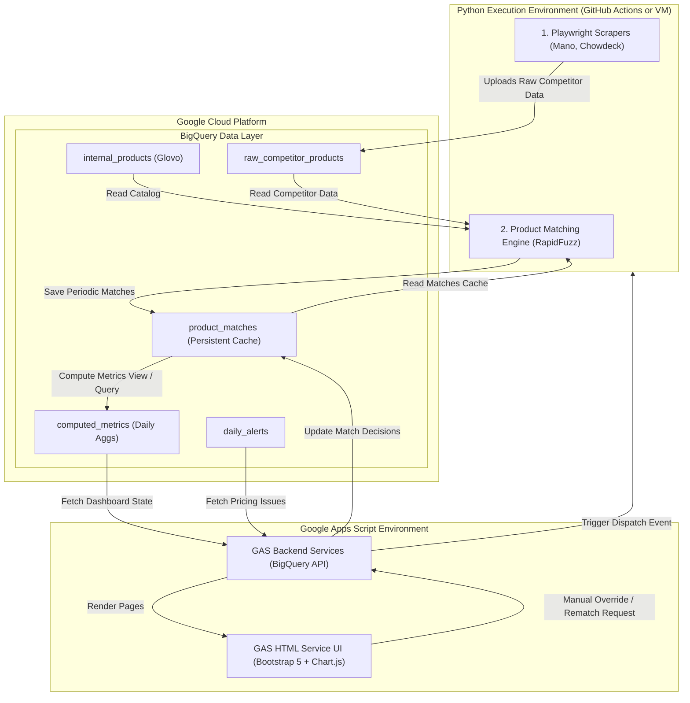

# Price Guard – System Architecture Specification

This document details the architectural layout, data flows, and hosting/integration models for the Price Guard Pricing Intelligence Platform.

---

## 1. System Overview

Price Guard is split into two primary environments connected by a central data layer (**BigQuery**):
1. **The Python Data Pipeline (Data Collection & Match Processing):** Handles Playwright-based scraping, raw data ingest, and fuzzy/semantic matching algorithms (RapidFuzz).
2. **The Google Apps Script Web App (Dashboard & Management UI):** Serves as a modern, high-performance SaaS frontend. It reads precomputed metrics from BigQuery and permits managers to trigger rematches and manually override matched products.



---

## 2. Decoupled Matching Engine Logic

The **Product Matching Engine** is decoupled from the daily scrape and alerts cycle:
- **Daily Cycle:** Scrapers pull prices. The platform runs anomaly detection and metric calculation using the *existing* active matches stored in the `product_matches` table.
- **Periodic/On-Demand Cycle:** The matching engine runs only when triggered (e.g., weekly, or when a user clicks "Rematch" in the Apps Script UI). It runs on:
  - New products added to the internal catalog.
  - New competitor listings.
  - Low-confidence matches (`confidence_score < 90%`).
  - Items manually flagged for rematching.

---

## 3. Google Apps Script - Python Bridge

### Data Synchronization via BigQuery
- The Python scripts upload and query tables in BigQuery using the `google-cloud-bigquery` library.
- Google Apps Script queries BigQuery tables using the native **BigQuery Advanced Service** (`BigQuery.Jobs.query`).

### Triggering Python from Apps Script (On-Demand Rematching)
When a user requests a rematch from the Apps Script dashboard, Apps Script triggers the remote Python runner:
1. **GitHub Actions Approach (Recommended):** Apps Script sends a POST request to the GitHub Repository Dispatch API:
   ```javascript
   UrlFetchApp.fetch("https://api.github.com/repos/owner/repo/dispatches", {
     method: "POST",
     headers: {
       "Authorization": "token " + GITHUB_PAT,
       "Accept": "application/vnd.github.v3+json"
     },
     payload: JSON.stringify({
       event_type: "run_rematch",
       client_payload: { sku: targetSku }
     })
   });
   ```
2. **Google Cloud Run Approach:** Apps Script sends an authenticated HTTP POST request to a Dockerized Python microservice hosted on Google Cloud Run.

---

## 4. BigQuery Schema Definitions

### 4.1 `internal_products`
Contains the snapshots of our own catalog.
* `product_sku` (STRING, Primary Key)
* `product_name` (STRING)
* `supplier_name` (STRING)
* `category_level_one` (STRING)
* `category_level_two` (STRING)
* `category_level_three` (STRING)
* `cost_price_today` (NUMERIC)
* `selling_price_today` (NUMERIC)
* `cost_price_last_month` (NUMERIC)
* `selling_price_last_month` (NUMERIC)
* `cost_price_last_2_months` (NUMERIC)
* `selling_price_last_2_months` (NUMERIC)
* `quantity_sold_latest` (NUMERIC)
* `revenue_latest` (NUMERIC)

### 4.2 `raw_competitor_products`
A unified, append-only or latest-snapshot table for competitor listings.
* `competitor` (STRING)
* `product_name` (STRING)
* `latest_price` (NUMERIC)
* `source_type` (STRING) — e.g. "scraper", "partner"
* `attributes` (STRING) — JSON block containing varying fields (barcode, brand, volume, images)
* `collected_at` (TIMESTAMP)

### 4.3 `product_matches`
Persistent, version-controlled cache of matches.
* `product_sku` (STRING) — Reference to `internal_products`
* `competitor` (STRING)
* `competitor_product_name` (STRING)
* `confidence_score` (NUMERIC) — 0 to 100
* `match_method` (STRING) — e.g. "barcode", "exact", "fuzzy", "manual_override"
* `match_explanation` (STRING)
* `is_approved` (BOOLEAN) — Matches with confidence < 90% default to FALSE and wait for manual approval.
* `last_matched_date` (TIMESTAMP)
