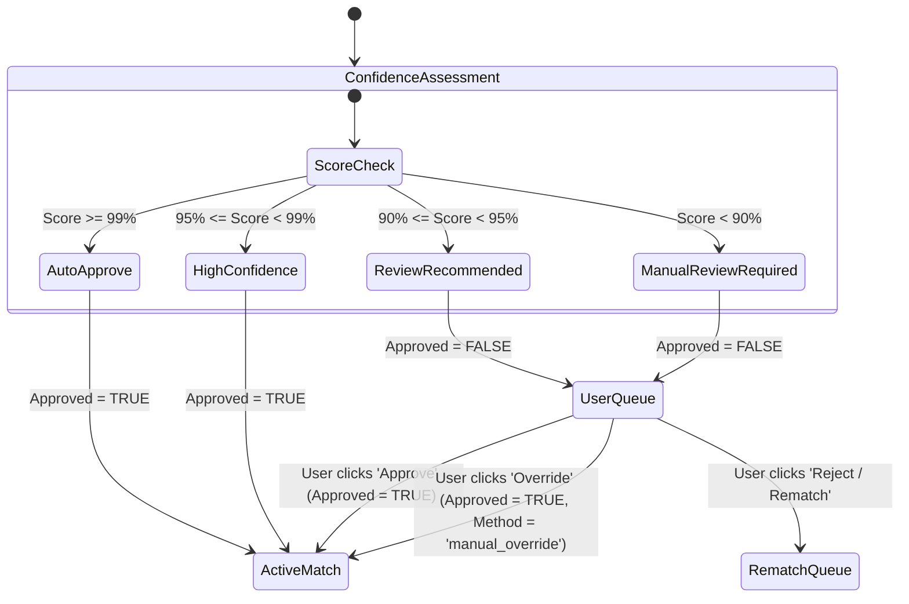

# Price Guard – Product Matching Engine Specification

This specification outlines the logic, multi-layer matching heuristics, confidence scoring, persistence model, and human review loop for matching external competitor items with internal SKUs.

---

## 1. Multi-Layer Heuristics

The matching engine uses a phased, fall-through approach to evaluate competitor products against our internal catalog.

| Layer | Matching Strategy | Details |
| :--- | :--- | :--- |
| **Layer 1** | **Exact ID Match** | Match using standard `product_barcode` or identical `sku` (where partner integrations supply SKU mappings). |
| **Layer 2** | **Name Normalization** | Convert names to lowercase, remove punctuation, special characters, spaces, hyphens, and standard abbreviations (e.g. "cl", "g", "ml", "pet", "can", "pack"). |
| **Layer 3** | **Attribute Extraction** | Extract brand, pack count, volume/weight, units, flavor, and variant from normalized strings using regular expressions. |
| **Layer 4** | **Fuzzy Token Matching**| Use **RapidFuzz** to calculate:  - `token_set_ratio` - `token_sort_ratio` - `partial_ratio` |
| **Layer 5** | **Semantic Validation** | Cross-verify extracted attributes (Brand, size/volume/weight, unit, pack count, and category similarity). Penalize matches where attributes mismatch (e.g., Coke Zero vs Coke Classic). |
| **Layer 6** | **Competitor Consensus**| Increase the confidence score if multiple competitors agree on matching the same SKU using similar attributes. |
| **Layer 7** | **Historical Stability** | Prefer maintaining existing approved matches over proposing new matching items unless the match confidence significantly degrades. |
| **Layer 8** | **AI-Assisted Validation**| For high-value/uncertain items (`confidence_score` between 85% and 95%), dispatch pairs to a LLM for binary matching classification. |

---

## 2. Match Cache Persistence & Trigger Model

Matches are saved persistently in the `product_matches` BigQuery table. They are not recalculated daily.

### 2.1 Rematching Conditions
An internal SKU or competitor product will be sent to the matching pipeline *only* under the following conditions:
1. **New Listing:** The product SKU does not exist in the `product_matches` table.
2. **Low Confidence:** The SKU has a match with `confidence_score < 90%`.
3. **Internal Detail Updates:** The name or barcode of the internal SKU has changed.
4. **Manual Rematch Flag:** The product has been flagged as `needs_rematch = TRUE` by a manager in the GAS Web App.

---

## 3. Human Review & Approval Workflow

The system groups match confidence into four categories that drive the UI verification queue:

### 3.1 Confidence Tiers
* **99% - 100%:** Auto-approve. Set `is_approved = TRUE` and active.
* **95% - 99%:** High confidence. Auto-approve, but list as verified.
* **90% - 95%:** Review recommended. Set `is_approved = FALSE` (hidden from daily gap metrics) and add to the Review Queue.
* **Below 90%:** Manual review required. Set `is_approved = FALSE` and prompt manager for manual search or override.